  <picture>
    <source media="(prefers-color-scheme: dark)" srcset="assets/banner-dark.v9.svg">
    <source media="(prefers-color-scheme: light)" srcset="assets/banner-light.v9.svg">
    
  </picture>

 

# Brais Fernández

🎓 Ingeniero Informático · Universidade da Coruña  
💻 Backend · Cloud · DevOps · Infrastructure as Code

Actualmente cursando el Máster en Ingeniería Informática en la Universidade da Coruña.

Me interesa especialmente el desarrollo backend, las arquitecturas distribuidas,
la infraestructura cloud y la automatización.

## Tecnologías

**Backend**
- Java · Spring Boot
- Python · Django
- APIs REST · Microservicios

**Cloud & Infrastructure**
- Docker
- AWS
- Ansible · Vagrant
- Linux

**Observabilidad**
- Grafana · Loki · Tempo · Mimir

**Bases de datos**
- PostgreSQL · MySQL · MongoDB

## Proyectos destacados

🔹 **Cloud-Native Observability & Distributed Storage**  
Infraestructura reproducible con MinIO, Docker, Ansible, Vagrant y Grafana/Loki/Tempo/Mimir.